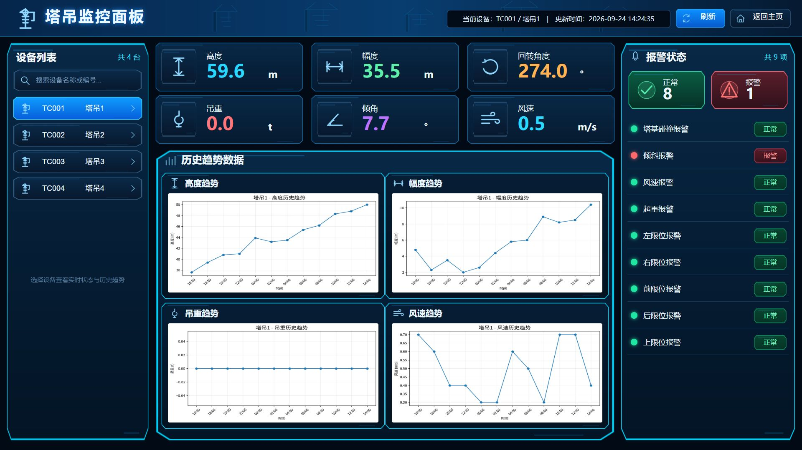

# TowerCrane UI 转换示例

这是 Unity 通用 HTML to UGUI 转换器的复杂界面样例，不是已获用户批准的正式设计。HTML 入口为 [`html/TowerCraneDashboardPanel.html`](html/TowerCraneDashboardPanel.html)，示例物体名称、用途、父级与绑定记录在 [`html/elements.json`](html/elements.json)。清单状态为 `converter-example-unapproved`，不能用作布局审批或最终视觉验收证据。

## 示例行为与资源



[设备切换截图与复现步骤](../../docs/screenshots/README.md)。截图使用内置示例数据，不是 Unity 运行或最终视觉验收证据。

浏览器预览包含 TC001～TC004 四台设备、六个实时指标和九类报警。历史趋势只展示高度、幅度、吊重、风速四项，固定 2×2 排列，没有倾角历史图。浏览器预览脚本支持设备选择和搜索；Unity 导入器不会执行这些 JavaScript，也不会把它们转换为 C#。

PNG 是运行时素材，放在 `html/assets/`；SVG 源图在 `inputs/art-source/`；原始方向参考图在 `inputs/references/`。可见文字由 HTML/TMP 提供，不烘焙到 Sprite。复杂边框使用九宫格；当前 Sprite Border（左、下、右、上）为：panel `24,24,24,24`、card `22,22,22,22`、chart_frame `24,24,24,24`、button `18,18,18,18`、pill `14,14,14,14`。

## 1920×1080 布局

坐标原点在左上角；导入时转换为左上 Anchor，Unity Y 轴取负。

| 区域 | X | Y | 宽 | 高 |
| --- | ---: | ---: | ---: | ---: |
| Group_Header | 0 | 0 | 1920 | 88 |
| Group_Device | 16 | 102 | 340 | 956 |
| Group_Main | 372 | 102 | 1100 | 956 |
| Group_Alarm | 1486 | 102 | 418 | 956 |
| Group_RealtimeMetrics | 372 | 102 | 1100 | 244 |
| Group_History | 372 | 360 | 1100 | 698 |

实时指标为高度、幅度、回转角度、吊重、倾角和风速，共 3×2 个卡片；每张 `354×118`，水平间距约 19px、垂直间距 8px。历史图为高度、幅度、吊重和风速，固定 2×2 排列，每张 ChartCard `536×304`。报警示例覆盖 BaseCollision、Tilt、WindSpeed、Overload、LeftLimit、RightLimit、FrontLimit、RearLimit、UpperLimit。

示例 CanvasScaler 参考值为 Scale With Screen Size、1920×1080、Expand。导入器只在场景没有可复用的活动根 Canvas 时新建 Canvas；已有 Canvas 的 CanvasScaler 设置会保留。

## 导入后的对象层级

`TowerCraneDashboardPanel` 是唯一根 Panel，区域、控件和列表容器均为其子物体。导入后的两个 ScrollView 只保留空的 `Group_Content`；Item 是单独的 Prefab，不是主 Panel 的运行时列表行：

```text
Canvas
└─ TowerCraneDashboardPanel
   ├─ Group_Header
   │  ├─ Img_Logo
   │  ├─ Txt_Title
   │  ├─ Txt_HeaderDeviceAndUpdate
   │  ├─ Btn_Refresh
   │  └─ Btn_Home
   ├─ Group_Device
   │  ├─ Txt_DeviceCount
   │  ├─ Group_Search
   │  │  └─ Input_DeviceSearch
   │  └─ Scroll_DeviceList
   │     └─ Group_Content  (empty)
   ├─ Group_Main
   │  ├─ Group_RealtimeMetrics
   │  │  ├─ Group_HeightMMetric
   │  │  ├─ Group_RadiusMMetric
   │  │  ├─ Group_SlewAngleDegMetric
   │  │  ├─ Group_LoadTMetric
   │  │  ├─ Group_TiltAngleDegMetric
   │  │  └─ Group_WindSpeedMpsMetric
   │  └─ Group_History
   │     ├─ Group_HeightTrend
   │     ├─ Group_RadiusTrend
   │     ├─ Group_LoadTrend
   │     └─ Group_WindSpeedTrend
   └─ Group_Alarm
      ├─ Group_NormalSummary
      ├─ Group_AlarmSummary
      └─ Scroll_AlarmList
         └─ Group_Content  (empty)
```

主 Prefab 位于 `Assets/Art/UIPrefab/TowerCraneDashboardPanel/TowerCraneDashboardPanel.prefab`。动态条目 Prefab 位于同目录的 `Items/Item_Device.prefab` 和 `Items/Item_Alarm.prefab`，内部根名与文件名一致；`UiTemplateCatalog` 将 `DeviceItem`、`AlarmItem` 逻辑键指向对应资源。通用导入器不会创建业务数据或运行时列表行，实际列表由接入项目负责。

图片素材导入至 `Assets/Art/UI/Sprite/TowerCraneDashboardPanel/`。完整通用命名规则、流程及 Unity 导入边界分别见 [Skill](../../Skills/ui-panel-design-to-html/SKILL.md) 和独立 package 的 README。Unity 工程中不保存本示例 HTML、CSS、预览 JS、布局图或审核材料。
