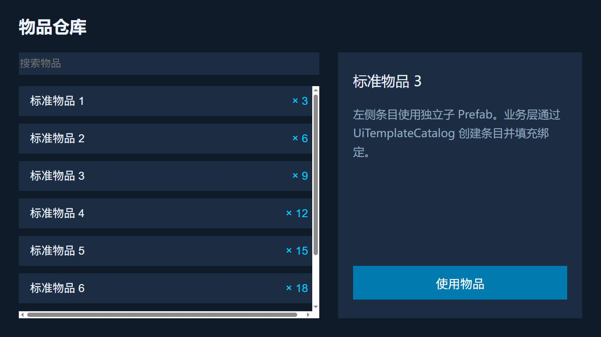
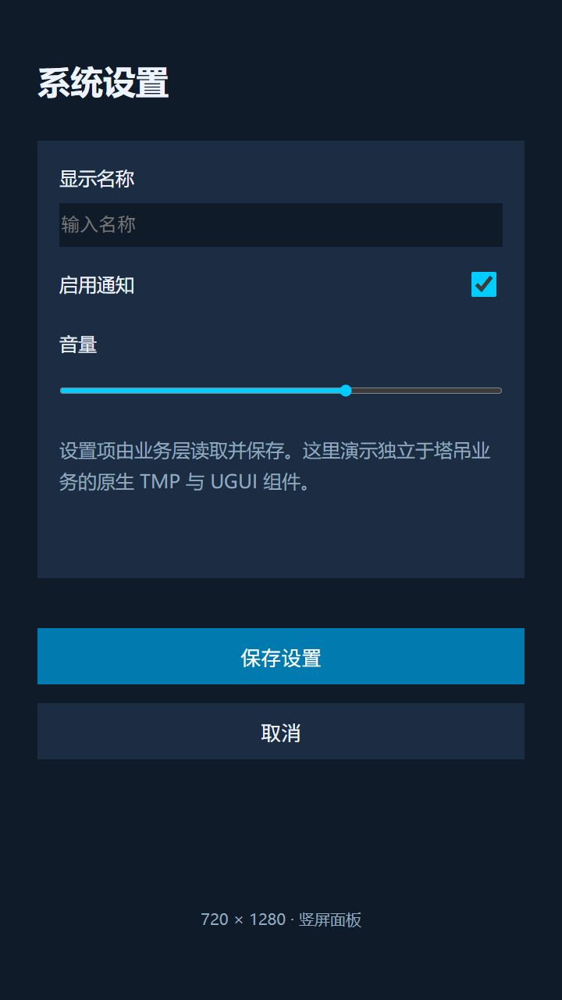

# HTML to Unity UGUI Workflow

[简体中文](README.md) | [English](README.en.md)

[](https://github.com/xzzhuu/html-to-unity-ugui-workflow/actions/workflows/verify.yml)
[](LICENSE)

从 UI 需求与布局审核，到可预览 XHTML，再到 Unity 原生 UGUI / TextMesh Pro 的可复用工作流。

本仓库包含一个 Codex Skill、四组外部 HTML 示例、Python 工具，以及 `com.nexvr.html-to-ugui` 0.2.0 的完整 UPM 源码。设计源文件留在 Unity 工程外；转换器生成图片、Panel / Item Prefab 和通用绑定元数据，业务数据与交互由接入应用实现。

完整英文说明见 [English README](README.en.md)。

## 功能与边界

- 初始化标准 HTML UI 目录，重复调用保留现有内容。
- 记录元素用途、语义名称、父级、原生组件、绑定与动态 Item 模板。
- 校验 XHTML、素材、清单、审批记录和就绪状态。
- 导入准备好的 XHTML 和 PNG 为原生 UGUI/TMP Panel 与 Item Prefab。
- 提供浏览器预览与结构验证；转换器支持有限 CSS 子集，不能保证任意网页自动复刻。

TowerCrane 是 `converter-example-unapproved` 转换示例，Starter 是 `draft-unapproved` 草稿。它们没有被标记为用户批准的正式视觉交付。结构校验通过不代表视觉一致性通过，浏览器 JavaScript 也不会转换成 Unity 业务逻辑。

## 示例截图

以下为仓库 HTML 在浏览器中的实际预览，使用内置示例数据；不是 Unity 运行截图或已批准的最终视觉交付。示例界面目前为中文。

### TowerCrane · 1920 × 1080

设备列表、六项实时指标、四张历史趋势图与报警状态。


| Inventory · 1280 × 720 | Settings · 720 × 1280 |
| --- | --- |
| 动态物品列表与条目选择 | 输入框、通知开关与音量滑块 |
|  |  |

[完整截图与复现说明](docs/screenshots/README.md) 还包含设备切换状态及 Starter 初始化草稿。

## 快速开始

要求：Python **3.10+**；Unity 导入要求 **2022.3**、UGUI 1.0.0、TMP 3.0.7。浏览器打开示例不要求 Unity。

```sh
git clone https://github.com/xzzhuu/html-to-unity-ugui-workflow.git
cd html-to-unity-ugui-workflow
python -X utf8 Skills/ui-panel-design-to-html/scripts/init_directory.py --root ./MyUI/Inventory --panel-name InventoryPanel
python -X utf8 Skills/ui-panel-design-to-html/scripts/validate_directory.py --root ./MyUI/Inventory
```

在浏览器打开生成的 `MyUI/Inventory/html/InventoryPanel.html`，或直接打开 [Inventory 示例](Examples/Inventory/html/InventoryPanel.html)。初始化会创建未审核草稿。

### 安装 Codex Skill

```sh
python -X utf8 Tools/install-global-skills.py
```

默认安装到 `~/.codex/skills`，支持 `CODEX_HOME` 和 `--destination`。安装器更新自己管理的文件并保留未知用户文件；会清理此前由它管理的旧工作流 Skill。

在新的 Codex 任务中调用：

```text
$ui-panel-design-to-html 我以“新文件目录”的身份调用，请初始化当前目录。
```

正式设计可调用：`$ui-panel-design-to-html 请根据需求和参考图制作 UI Panel，先给出布局图与完整性清单供我审核。`

### 安装 Unity 转换包

在 Package Manager 使用 **Add package from disk**，选择本仓库 `Packages/com.nexvr.html-to-ugui/package.json`。

或使用 **Add package from git URL**：

```text
https://github.com/xzzhuu/html-to-unity-ugui-workflow.git?path=/Packages/com.nexvr.html-to-ugui
```

导入 TMP Essential Resources 并选择包含所需字符的 TMP 字体，然后用 **Tools → HTML to UGUI → Import Panel...** 选择工程外准备好的 HTML。

图片输出到 `Assets/Art/UI/Sprite/{PanelName}/`；主 Prefab 输出到 `Assets/Art/UIPrefab/{PanelName}/`，动态 Item 在 `Items/`。根 Panel 放在 Canvas 下，场景需要手动保存。详细输入契约与限制见 [包说明](Packages/com.nexvr.html-to-ugui/README.md)。

## 仓库结构

| 目录 | 用途 |
| --- | --- |
| [Skills/ui-panel-design-to-html](Skills/ui-panel-design-to-html/SKILL.md) | 唯一工作流 Skill、契约、脚本与可编辑流程图 |
| [Examples](Examples/README.md) | Settings、Inventory、Starter、TowerCrane 外部 HTML |
| [Packages/com.nexvr.html-to-ugui](Packages/com.nexvr.html-to-ugui/README.md) | Unity Editor 转换器与通用 Runtime 元数据 |
| [Tools](Tools/README.md) | 安装、校验、布局比较与打包工具 |
| [UnityProject](UnityProject/README.md) | Unity 2022.3 示例工程；字体资源需自行恢复 |
| [Audit](Audit/README.md) | 公开分发说明；机器运行结果不进入 Git |

## 验证与打包

```sh
python -m pip install -r requirements-dev.txt
python -X utf8 Tools/verify-directory-generator.py
python -X utf8 Tools/verify-preparation-contract.py
python -X utf8 Tools/verify-installer.py
python -X utf8 Tools/verify-workflow-files.py
python -X utf8 Tools/verify-file-integrity.py
python -X utf8 Tools/build-unity-package.py
```

包文件和逐文件校验报告写入 `dist/`，运行记录写入 `Audit/Runs/latest/`。GitHub Actions 在 Windows / Ubuntu 与 Python 3.10 / 3.12 上执行这些检查并保存包文件；**不包含 Unity Editor 编译或视觉验收**。

## 参与与许可

请阅读 [贡献指南](CONTRIBUTING.md)、[行为准则](CODE_OF_CONDUCT.md)、[安全策略](SECURITY.md) 和 [更新记录](CHANGELOG.md)。错误与功能建议可通过 GitHub Issues 提交。

本项目采用 [MIT 许可证](LICENSE)。第三方依赖、字体与 Unity 软件适用各自许可，见 [第三方说明](THIRD_PARTY_NOTICES.md)。
