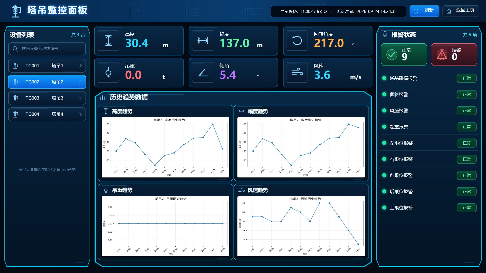

# Example screenshots / 示例演示截图

[简体中文项目说明](../../README.md) | [English project overview](../../README.en.md)

Captured on 2026-09-26 in the Codex in-app Chromium browser from the repository's actual HTML/CSS/JavaScript and bundled assets. These PNGs contain the example panel only, without browser chrome. Panel crops preserve the original canvas dimensions; no visual content was generated or retouched.

截图来自仓库实际 HTML 浏览器预览，保留画布原始尺寸，不包含浏览器工具栏，没有生成或修饰界面内容。截图中的时间、设备和指标来自内置示例数据，不表示实时设备接入。截图不构成布局审批、Unity 运行验证或最终视觉验收。

## TowerCrane dashboard / 塔吊仪表盘

Source: [TowerCraneDashboardPanel.html](../../Examples/TowerCrane/html/TowerCraneDashboardPanel.html). Canvas: **1920 × 1080**. Initial selection: **TC001**, with one alarm in the bundled preview data. The example retains `converter-example-unapproved` status.


### Device switching / 设备切换

Click **TC002 塔吊2**. The selected device, metric values, charts, and alarm summary change; bundled TC002 data has no active alarms. This interaction belongs to the browser preview script, not generated Unity application logic.

点击第二台设备后，指标、趋势图及报警统计更新；浏览器预览逻辑不会自动转换为 Unity 业务逻辑。



## Inventory / 物品仓库

Source: [InventoryPanel.html](../../Examples/Inventory/html/InventoryPanel.html). Canvas: **1280 × 720**. Click **标准物品 3 × 9** to show item 3 in the detail area and enable the use button. The screenshot preserves the example's existing scrollbars.


## Settings / 系统设置

Source: [SettingsPanel.html](../../Examples/Settings/html/SettingsPanel.html). Canvas: **720 × 1280**. Captured in its default state: empty display name, notifications enabled, and volume **65**. This is a native form-control layout example; saving application settings requires implementation in the receiving Unity project.


## Starter / 初始化草稿

Source: [StarterPanel.html](../../Examples/Starter/html/StarterPanel.html). Canvas: **1280 × 720**. Status: **draft-unapproved**. Its intentionally minimal content demonstrates initialization; it is not a finished business UI.


## Reproduce / 复现

From the repository root, serve the files locally:

```sh
python -m http.server 8765 --bind 127.0.0.1
```

Open the desired example under `http://127.0.0.1:8765/Examples/`, follow the interactions described above, and capture the full Panel at its listed canvas size. Font rendering and native form controls may vary by browser and operating system. Stop the server with Ctrl+C when finished.

从仓库根目录启动服务后，打开对应 HTML，按上述操作进入截图状态。浏览器和系统字体会影响字形及原生控件表现。截图采用 MIT 许可，与本仓库示例一致。
